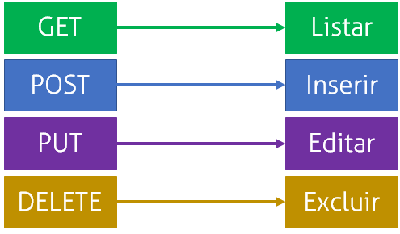

# Roteiro de aula

### Revisão das ferramentas para a aula (10min)
- Certificar de que todos tenham instalado o Postam ou Curl e saibam o uso do mesmo
- Disponibilizar uma api simples para ser baixada pelos alunos, os mesmos farão o download
- Certificar que todos estão com a api rodando em suas máquinas

### Revisão dos conceitos do que é uma api (5min)
- Revisar o conhecimento do que é uma api
- Revisar conceitos de request e response

### Apresentação dos conceitos do que são os verbos http (5min)

- Explicação de cada verbo

### Entendimento do que ja existe (10min)
- Vou navegar em sites que ja existem e fazer enquetes no site [mentimeter](https://www.mentimeter.com/) perguntando qual verbo eles acreditam que a ação que estou executando na tela está utilizando

### Apresentação dos conceitos do que são os verbos http (20min)
- Exemplo prático da explicação utilizando a api simples que foi feita download agora pouco
- A idéia é ir implementando, paso a passo, endpoints que utilizem os 4 verbos (`Get`, `Post`, `Put`, `Delete`), eu fazendo e eles fazendo junto. 
- Quero que eles vejam os resultados no Postman

### Exercício em aula (10min)
- Aplicar o exercício de alternativas para os verbos http rest.

